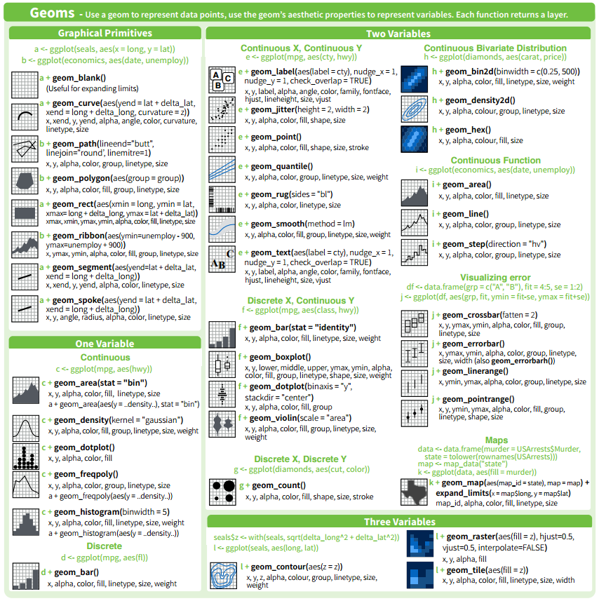

```{r}
rm(list=ls())
data(diamonds)
head(diamonds)
data(mtcars)
head(mtcars)
```

```{r}
# Inspired by the image-density plots of Ken Knoblauch
cars <- ggplot(mtcars, aes(mpg, factor(cyl)))  #cyl numero de cilindros   #mpg millas por galón
cars + geom_point() + geom_bin2d()
```

```{r}
diamantes<-data.frame(diamonds[,"price"],diamonds[,"carat"],diamonds[,"cut"])
ggplot(diamantes,aes(x=price,y=carat,color=cut)) +
  geom_point(shape=1)

ggplot(diamantes,aes(x=price,y=carat)) + xlim(0,6000) + #con XLIM e YLIM puede liminar la gráfica. Hacer ZOOM en una parte concreta.
  geom_bin2d()
```

Faceting
Consiste en agrupar el dataframe según factores y pintar scatterplots de variables en función de esos agrupamientos:
```{r}
data(mpg)
head(mpg)
```

```{r}
qplot(data = mpg, x = displ, y = hwy, color = manufacturer, facets = ~class)
```

```{r}
install.packages("plotly")
library(reshape2) #facilita la trasnformación entre diferentes formatos de datos.
library(plotly) #https://plot.ly/r/
```


```{r}

sp <- ggplot(tips, aes(x=total_bill, y=tip/total_bill)) + geom_point(shape=1)

# Divide by levels of "sex", in the vertical direction
sp + facet_grid(sex ~ .)
ggplotly() #vista optimizada y con muchas herramientas!!!
```

```{r}
sp <- ggplot(tips, aes(x=total_bill, y=tip/total_bill)) + geom_point(shape=1)

# Divide by levels of "sex", in the vertical direction
sp + facet_grid(. ~sex  )
ggplotly() #vista optimizada y con muchas herramientas!!!
```

Dividimos por sex en vertical y day en horizontal:
```{r}
sp + facet_grid(sex ~ day)
```

```{r}
sp + facet_wrap( ~ day, ncol=2)  #con facet_grid no hay la posibilidad de especificar columnas
```

```{r}
# A histogram of bill sizes
hp <- ggplot(tips, aes(x=total_bill)) + geom_histogram(binwidth=2,colour="white")
hp
# Histogram of total_bill, divided by sex and smoker
hp + facet_grid(sex ~ smoker)
```

```{r}
# Same as above, with scales="free_y"
hp + facet_grid(sex ~ smoker, scales="free_y")  #Escalas diferentes para la Y
```

```{r}
# With panels that have the same scaling, but different range (and therefore different physical sizes)
hp + facet_grid(sex ~ smoker, scales="free", space="free")
```

